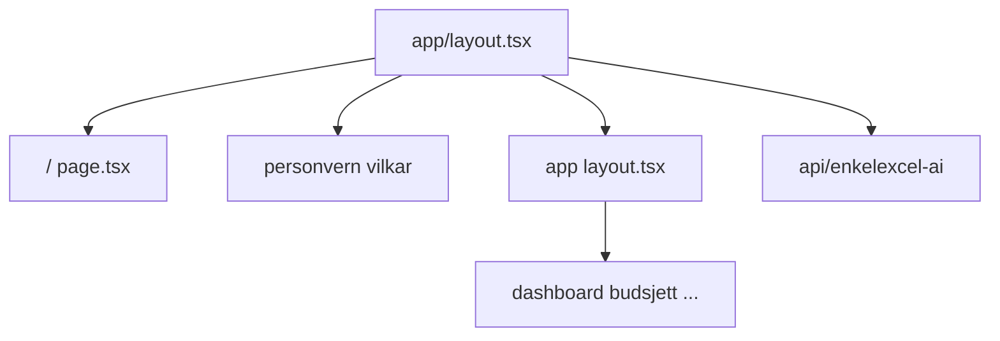

# Arkitektur — kort oversikt

## Stack

- **Next.js** (App Router) — [`src/app/`](../src/app/)
- **React** + **TypeScript**
- **Tailwind CSS** v4 — [`src/app/globals.css`](../src/app/globals.css) med `@import "tailwindcss"`
- **Zustand** med `persist` — global app-state i [`src/lib/store.ts`](../src/lib/store.ts) (budsjett, transaksjoner, profiler, m.m.)
- **Recharts** — grafer på dashboard og andre sider

## Ruter

- **`/`** — Markedsføringslanding ([`src/app/page.tsx`](../src/app/page.tsx)), **uten** sidebar.
- **`(app)`** — Route group [`src/app/(app)/layout.tsx`](../src/app/(app)/layout.tsx) med [`Sidebar`](../src/components/layout/Sidebar.tsx) + `main`. Undermapper (`dashboard`, `budsjett`, …) gir samme URL som før (f.eks. `/dashboard`).
- **`/personvern`**, **`/vilkar`** — Juridiske stubber på rot av `app/`.
- **API** — [`src/app/api/`](../src/app/api/) (f.eks. Claude-rute).

## Bygg

- `npm run build` bruker `next build --experimental-app-only` (se [`package.json`](../package.json)) for å unngå kjente problemer med Pages-router-artefakter i dette prosjektet.

## Viktige mapper

| Mappe | Innhold |
|-------|---------|
| [`src/components/`](../src/components/) | layout, ui, marketing, feature-komponenter |
| [`src/lib/`](../src/lib/) | store, utils, kataloger, eksport |

## Abonnement i app (kode)

- Plan-typer og familiegrenser er definert i `store.ts` (f.eks. `SubscriptionPlan`, `MAX_FAMILY_PROFILES`). Produkt-/prisbeskrivelse for kunder ligger i [`PRIS-OG-ABONNEMENT.md`](./PRIS-OG-ABONNEMENT.md).
