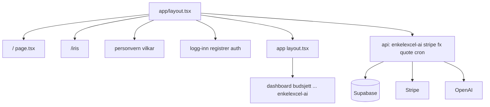

# Arkitektur — kort oversikt

## Stack

- **Next.js** 15 (App Router) — [`src/app/`](../src/app/)
- **React** 19 + **TypeScript**
- **Tailwind CSS** v4 — [`src/app/globals.css`](../src/app/globals.css) med `@import "tailwindcss"`
- **Zustand** med `persist` — global app-state i [`src/lib/store.ts`](../src/lib/store.ts) (budsjett, transaksjoner, profiler, m.m.)
- **Supabase** — [`@supabase/ssr`](https://supabase.com/docs/guides/auth/server-side/nextjs) + [`@supabase/supabase-js`](../package.json): autentisering, synkron app-tilstand, abonnement, AI-bruk og roadmap-data (se migrasjoner under)
- **Stripe** — Checkout for Solo/Familie-abonnement og valgfritt kjøp av ekstra AI-meldinger; status synkes via webhook med service role
- **OpenAI** — EnkelExcel AI (server-side API, ikke eksponert til klient som nøkkel)
- **Recharts** — grafer på dashboard og andre sider
- **Zod**, **React Hook Form** — skjemaer og validering der det trengs

## Autentisering og tilgang

- Innlogging/registrering: Supabase Auth (`/logg-inn`, `/registrer`, `/auth/callback`). Glemt passord: `/glemt-passord` sender e-post; etter lenke etableres økt via `/auth/callback` og bruker settes nytt passord på `/tilbakestill-passord` (kun når Supabase emitter `PASSWORD_RECOVERY`; ellers redirect til `/konto/sikkerhet`). I Supabase Dashboard må **Redirect URLs** inkludere appens `/auth/callback`, og malen **Reset password** må tillate samme redirect som `resetPasswordForEmail` bruker (se [`.env.example`](../.env.example)).
- [`middleware.ts`](../src/middleware.ts) sjekker sesjon for alle ruter unntatt offentlige stier (landing, juridiske sider, innlogging/registrering/glemt passord). Uten `NEXT_PUBLIC_SUPABASE_*` redirectes beskyttede ruter til innlogging med `?error=config`.
- Brukerdata og server-side operasjoner som krever hemmelige nøkler (Stripe-webhook, AI-kvote) bruker **service role** eller server routes — se [`.env.example`](../.env.example).

## Ruter (utvalg)

**Offentlig (uten app-sidebar)**

| Sti | Beskrivelse |
|-----|-------------|
| `/` | Markedsføringslanding |
| `/iris` | Kampanjevariant (partner); `/?ref=iris` redirectes hit |
| `/logg-inn`, `/registrer`, `/glemt-passord` | Auth (glemt passord er offentlig; `/tilbakestill-passord` krever økt etter e-postlenke) |
| `/personvern`, `/vilkar` | Juridiske sider |
| `/auth/*` | OAuth / callback |

**App** — route group [`(app)`](../src/app/(app)/) med [`AppShell`](../src/components/layout/AppShell.tsx) (desktop-sidebar + mobilmeny; navigasjonsinnhold i [`SidebarContent`](../src/components/layout/SidebarContent.tsx)):

| Sti | Merknad |
|-----|---------|
| `/dashboard` | Oversikt |
| `/budsjett`, `/budsjett/dashboard` | Budsjett |
| `/transaksjoner`, `/transaksjoner/dashboard` | Transaksjoner |
| `/sparing`, `/sparing/formuebygger` | Sparing |
| `/gjeld` | Gjeld |
| `/snoball` | Snøballstrategi |
| `/investering` | Investering (kurs m.m.) |
| `/rapporter`, `/rapporter/sparemal`, `/rapporter/bank` | Rapporter |
| `/enkelexcel-ai` | EnkelExcel AI |
| `/konto`, `/konto/betalinger`, `/konto/innstillinger`, `/konto/sikkerhet`, `/konto/budsjett-kategorier`, `/konto/roadmap` | Konto og Stripe |
| `/innstillinger` | App-innstillinger (egen rute) |

## API (`src/app/api/`)

| Rute | Formål |
|------|--------|
| [`enkelexcel-ai`](../src/app/api/enkelexcel-ai/route.ts) | AI-svar (OpenAI) |
| [`enkelexcel-ai/usage`](../src/app/api/enkelexcel-ai/usage/route.ts) | Månedlig AI-bruk / kvote for innlogget bruker |
| [`stripe/checkout`](../src/app/api/stripe/checkout/route.ts) | Checkout for abonnement |
| [`stripe/subscription`](../src/app/api/stripe/subscription/route.ts) | Les abonnementsstatus (`user_subscription`) for innlogget bruker |
| [`stripe/billing-portal`](../src/app/api/stripe/billing-portal/route.ts) | Oppretter Stripe Customer Portal-økt (administrer kort, oppsigelse) |
| [`stripe/webhook`](../src/app/api/stripe/webhook/route.ts) | Stripe events → `user_subscription`, bonus-AI-kreditter, m.m. |
| [`stripe/ai-credits-checkout`](../src/app/api/stripe/ai-credits-checkout/route.ts) | Engangskjøp av ekstra AI-meldinger |
| [`fx`](../src/app/api/fx/route.ts), [`quote`](../src/app/api/quote/route.ts), [`quote/search`](../src/app/api/quote/search/route.ts) | Valuta og kurs (investering) |
| [`cron/investment-quotes`](../src/app/api/cron/investment-quotes/route.ts) | Planlagt kursoppdatering (beskyttes med `CRON_SECRET`) |

## Supabase — databaselag (migrasjoner)

Migrasjoner ligger i [`supabase/migrations/`](../supabase/migrations/):

| Fil | Innhold |
|-----|---------|
| `001_user_app_state.sql` | JSONB app-tilstand per bruker (RLS) |
| `002_user_subscription.sql` | Stripe-abonnement (`solo` / `family`), oppdatert fra webhook |
| `003_feature_roadmap.sql` | Feature-ønsker og stemming (`/konto/roadmap`) |
| `004_ai_monthly_usage.sql` | Månedlig AI-meldingskvote (kalendermåned Europe/Oslo) |
| `005_ai_bonus_credits.sql` | Ekstra AI-meldinger fra Stripe-kjøp (bonus-pool) |

**Miljø:** Se [`.env.example`](../.env.example) for `NEXT_PUBLIC_SUPABASE_*`, `SUPABASE_SERVICE_ROLE_KEY`, Stripe-nøkler og AI-relaterte variabler.

## Bygg og kjøring

- Utvikling: `npm run dev` (Turbopack) — alternativt `npm run dev:webpack`.
- Produksjon: `npm run build` → `npm start` (se [`package.json`](../package.json)).

## Viktige mapper

| Mappe | Innhold |
|-------|---------|
| [`src/components/`](../src/components/) | layout, ui, marketing, feature-komponenter |
| [`src/lib/`](../src/lib/) | store, Supabase-klienter, utils, kataloger |
| [`supabase/migrations/`](../supabase/migrations/) | databaseskjema |

## Abonnement og AI (kode)

- Plan-typer og familiegrenser: [`store.ts`](../src/lib/store.ts) (f.eks. `SubscriptionPlan`, `MAX_FAMILY_PROFILES`). Stripe-plan speiles i `user_subscription.plan`.
- Kundetekst om priser: [`PRIS-OG-ABONNEMENT.md`](./PRIS-OG-ABONNEMENT.md).
- AI: månedlig kvote (konfigurerbar via miljø) og valgfrie **bonus-meldinger** kjøpt via Stripe; se `.env.example` (`AI_MONTHLY_MESSAGE_LIMIT`, `STRIPE_PRICE_AI_CREDITS_*`, osv.).
